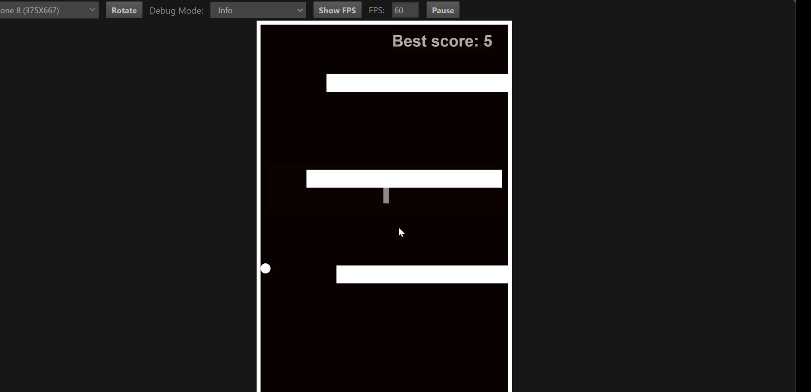
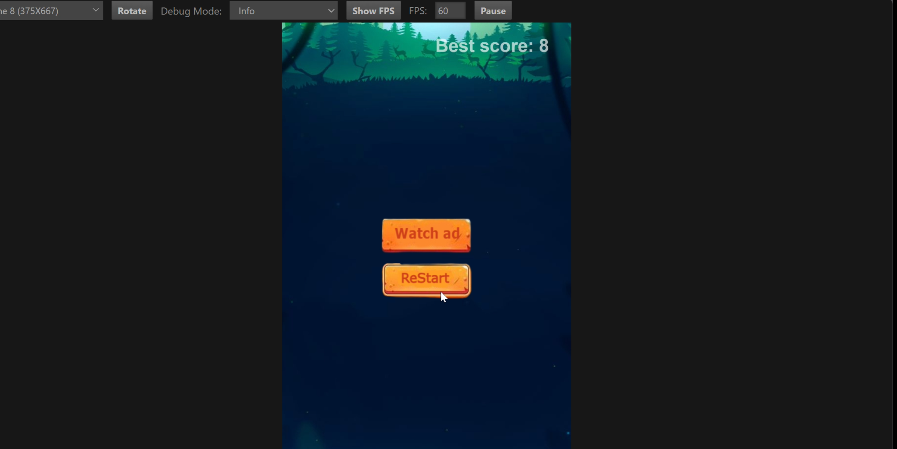

# Jump Dash - A Cocos Creator Game

## Table of Contents
- [Introduction](#introduction)
- [Demo](#demo)
- [Features](#features)
- [Installation](#installation)
- [Game Controls](#game-controls)
- [Project Structure](#project-structure)
- [Build and Deployment](#build-and-deployment)
- [Contributing](#contributing)
- [License](#license)

## Introduction
Jump Dash is an exciting, fast-paced platformer game built using **Cocos Creator**. The game challenges players to navigate through a series of obstacles by jumping at the right time to avoid falling or crashing. With engaging mechanics and smooth animations, Jump Dash provides a thrilling experience for players of all skill levels.

## Demo



[](https://www.youtube.com/watch?v=aKcbyxHxsH4)
## Features
- **Endless Runner Gameplay**: The player keeps moving forward and must time their jumps to survive
- **Obstacle Avoidance**: Dynamic obstacles increase in difficulty as the game progresses
- **Score System**: Track high scores and challenge yourself to improve
- **Smooth Animations**: Powered by Cocos Creator for seamless gameplay
- **Responsive Controls**: Simple yet precise touch and keyboard controls
- **Optimized for Web and Mobile**: Supports deployment on multiple platforms

## Installation

### Prerequisites
Ensure you have the following installed before running the game:
- Cocos Creator (version 3.x recommended)
- Node.js (optional, for additional development tools)
- A modern web browser (for previewing the game)

### Steps to Run the Game
1. Clone the repository:
   ```sh
   git clone https://github.com/your-repo/jump-dash.git
   ```

2. Navigate to the project folder:
   ```sh
   cd jump-dash
   ```

3. Open the project in **Cocos Creator**:
   - Launch Cocos Creator
   - Click **Open Project** and select the `jump-dash` folder

4. Run the game:
   - Click on **Preview** to run the game in the browser

## Game Controls
| Action | Keyboard | Touch (Mobile) |
|--------|----------|----------------|
| Jump | Spacebar | Tap on screen |
| Pause/Resume | P | Button on UI |

## Project Structure
```
jump-dash/
├── assets/                # Game assets (sprites, sounds, etc.)
├── scripts/              # Game logic scripts (TypeScript/JavaScript)
│   ├── player.ts         # Player control script
│   ├── obstacle.ts       # Obstacle behavior script
│   ├── gameManager.ts    # Game state manager
├── scenes/               # Cocos Creator scenes
├── config/               # Game configuration settings
├── package.json          # Dependencies (if using Node.js tools)
├── README.md             # Documentation
```

## Build and Deployment
To build the game for deployment:
1. Open **Cocos Creator** and navigate to **Project > Build**
2. Select the target platform (Web, Android, iOS, Windows, etc.)
3. Click **Build** and then **Play** to test the build
4. Deploy the generated build files to your desired platform

## Contributing
We welcome contributions! To contribute:
1. Fork the repository
2. Create a new branch (`feature-new-obstacle`)
3. Commit your changes and push to the branch
4. Open a pull request

## License
This project is licensed under the MIT License. Feel free to modify and distribute the game as per the license terms.

---

If you encounter any issues or have suggestions, feel free to open an issue in the repository. Enjoy Jump Dash!
